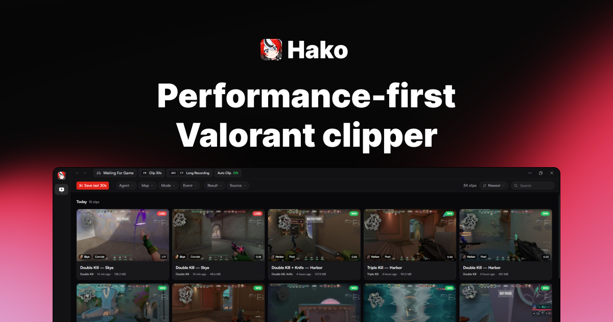

# Hako

A performance-first clip recorder built for one game: Valorant. It runs quietly in
the background, keeps the last couple of minutes of gameplay in a buffer, and cuts
your kills into clips on its own. Think of it as a lighter Medal.tv that does less,
but does it without eating your frames.



**Stack:** Tauri v2 + Rust for the core, React 19 with TanStack Router/Query for the
UI, TailwindCSS v4 and shadcn/ui for the styling. Windows only.

## What it does

- **Always-on instant replay.** While you play, Hako holds the last N seconds of
  encoded video in a buffer (120 s by default). Press the save hotkey (F9) and it
  writes the last 30 seconds to disk in well under a second, because the save is a
  stream copy with no re-encode. The buffer lives in RAM by default, or you can
  spool it to disk if you would rather trade steady disk writes for the memory.
- **Automatic Valorant highlights.** Hako reads Riot's local API and the game log
  to follow a match: when it starts, which round you are in, and when it ends.
  After the match it pulls the official match details, lines up each kill against
  the recording, and cuts a clip for every event you turned on. You can leave the
  hotkey alone for a whole session and still come back to a library full of plays.
- **You pick which moments count.** Auto-clip events cover kills, double through
  quadra, aces, knife kills, clutches, victories, deaths, assists, and spike
  plant/defuse. Each event has its own before/after window, so a spike clip can
  reach back the full 45-second fuse while a plain kill stays short.
- **Four capture modes.** Manual leaves you with the buffer and hotkey only.
  Highlights (the default) cuts per-event clips. Full match keeps the whole game as
  one file. Session records continuously while you are in game.
- **Capture that keeps up with the game.** The capture path is an OBS-style
  graphics hook, the same approach OBS and Medal use. It hooks the game's own
  `Present` and grabs frames at the real render rate, so it is not capped by
  desktop composition the way a naive desktop-duplication grab would be.
- **Hardware encoding, never software.** Frames go straight to NVENC, Quick Sync,
  or AMF. H.264, HEVC, and AV1 are supported. On the common case it captures and
  encodes on the same GPU with no copy between adapters, but it can also encode on
  a discrete NVENC card while the display hangs off an integrated GPU. If HEVC is
  not available it falls back to H.264. It never quietly drops to software x264 and
  tanks your frame rate.
- **Audio routed how you want it.** Capture all PC audio across one or more output
  devices, or pick specific apps when Windows per-process loopback is available.
  Mix in a microphone (optionally down-mixed to mono), set per-source volume, and
  keep every source on its own track so you can rebalance the mix later.
- **A clip editor, not just a list.** Clips, tags, and thumbnails live in SQLite.
  Trim losslessly with a stream copy, scrub a sprite-sheet filmstrip, and on export
  mute, solo, or rebalance each audio track. You can overwrite the original in
  place or save the result as a new clip.

## How it works

The Rust core splits into two halves.

The capture pipeline (`src-tauri/src/core/`) injects an OBS-derived graphics-hook
DLL into Valorant, shares the backbuffer back as a D3D11 texture, converts it to
NV12 on the GPU, and hands it to a hardware encoder. The compressed packets feed a
ring buffer that tracks keyframe positions, so any saved clip can start on a
keyframe at or before your cut point. One rule runs through the whole pipeline: the
CPU only ever touches compressed bytes, never raw frames. That is what keeps the
overhead low enough to run during a ranked game.

The Valorant integration (`src-tauri/src/valorant/`) is the brain. It authenticates
against the lockfile, subscribes to the presence websocket, and tails
`ShooterGame.log` for round-start anchors. A small state machine turns all of that
into match-started, round-boundary, and match-ended signals. When a match begins and
a capture is already running, Hako tees the same encode stream into a full-match
file; when it ends, it reconciles the kill timestamps to positions in that recording
and cuts the clips. The whole integration is read-only and isolated, so if Riot
changes something and it breaks, you drop back to manual hotkey clips instead of
losing recording entirely.

Capture auto-starts when the Valorant window appears and auto-stops when the game
exits, so the encoder is already warm before the first round. A capture you started
by hand is left alone.

## Prerequisites

- [Bun](https://bun.sh)
- Rust (stable, `x86_64-pc-windows-msvc`) plus the MSVC C++ build tools
- The WebView2 runtime, which ships with Windows 11

## Develop

```sh
bun install
pwsh -File scripts/fetch-ffmpeg.ps1   # one-time: fetch the bundled FFmpeg build
bun run tauri dev                     # runs Vite + the Rust core, opens the window
```

The FFmpeg 8.1 shared build (NVENC/AMF/QSV) lives in `src-tauri/ffmpeg/` and is
linked by `rusty_ffmpeg`, with paths set in `.cargo/config.toml`. It is gitignored
except `binding.rs`, the version-pinned prebuilt FFI binding; `build.rs` copies the
DLLs next to the built exe.

## Build

```sh
bun run tauri build   # release exe + installer
```

To iterate without the bundler:

```sh
bun run build                                       # type-check + Vite build → dist/
cargo build --manifest-path src-tauri/Cargo.toml    # compile the Rust core
```

## Layout

- `src/` is the React UI. The three screens are Clips (library and editor),
  Valorant (live match status), and Settings. Shadcn components live under
  `components/ui`, and `lib/api` holds the typed invoke wrappers.
- `src-tauri/src/` is the Rust core. `core/` holds capture, encode, and buffering;
  `valorant/` holds the Riot integration; `library/` holds clips, trimming, and
  thumbnails; `commands.rs` is the invoke surface the UI calls.
- Clips and thumbnails are written to `<Videos>/Hako`.
- `src-tauri/app-icon.png` is the source image for `bun tauri icon`.

## Notes

- Closing the window hides Hako to the tray and the recorder keeps running. Use the
  tray menu's **Quit** to stop it for real.
- Injecting into Valorant is the same technique OBS, Medal, and Overwolf use, and
  Vanguard tolerates legitimate capture software in practice. Injection can still
  fail (for example if the game is minimized and not presenting), in which case you
  get a start error rather than a crash.
- The long-recording hotkey shown in the titlebar is editable but not wired up yet.
